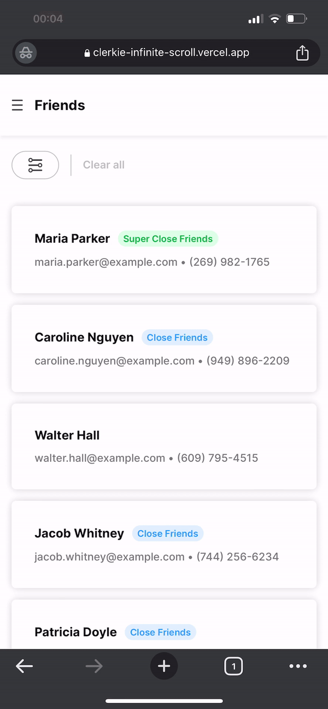

# Clerkie Infinite Scroll

Clerkie Infinite Scroll aims to implement an infinite scroll feature with filtering functionality. The application displays a list of friends and allows users to filter them based on their relationship status with the user. The filtering options include close friends, super close friends, and all friends. The infinite scroll feature is implemented using the SWR (React Hooks for Remote Data Fetching) library.

In addition, the project includes a skeleton loading state, which displays a temporary animation while waiting for the data to load. The loading state is implemented using CSS animations and keyframes.

## Features

- [Next.js 13 App Router](https://beta.nextjs.org/docs)  
- Infinite scroll functionality

 
- Fetches data from [headless CMS](https://strapi.io/) with [useSWRInfinite](https://swr.vercel.app/docs/pagination#useswrinfinite) hook
- Filter management with Context API and local storage 
 
- Responsive design
- Dark mode
 
