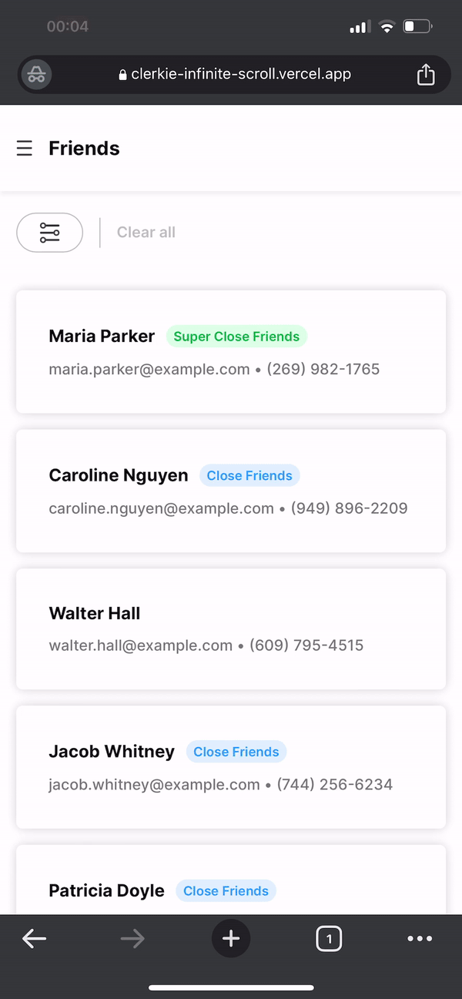

# Clerkie Infinite Scroll

Clerkie Infinite Scroll aims to implement an infinite scroll feature with filtering functionality. The application displays a list of friends and allows users to filter them based on their relationship status with the user. The infinite scroll feature is implemented using the SWR `stale-while-revalidate` library.

In addition, the project includes a skeleton screen loading state, which displays a temporary animation while waiting for the data to load. The loading state is implemented using CSS animations and keyframes.

### Built With

- [Next.js 13 App Router](https://beta.nextjs.org/docs)
- [React](https://react.dev/)
- [SCSS](https://sass-lang.com/)
- [Material UI](https://mui.com/)
- [Strapi](https://strapi.io/)

## Features

- Responsive design

- Fetches data from [headless CMS](https://strapi.io/) with [useSWRInfinite](https://swr.vercel.app/docs/pagination#useswrinfinite) hook

- Infinite scroll functionality

  

- Filter management with Context API and local storage

  

- Dark mode

  

- Skeleton screen for loading state

  
